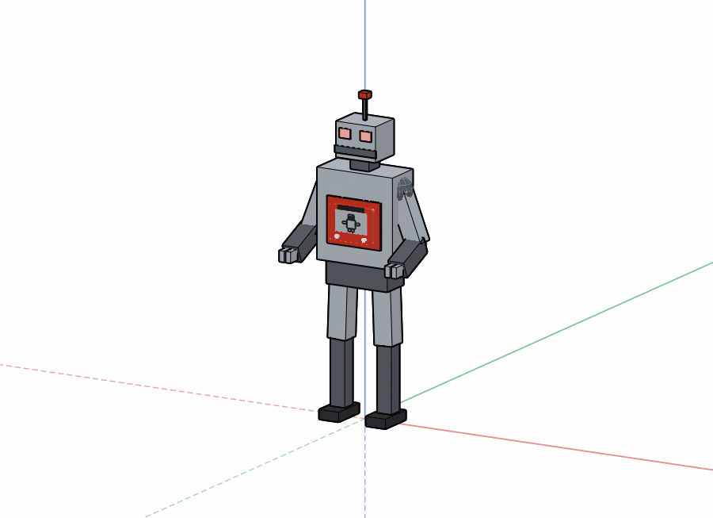
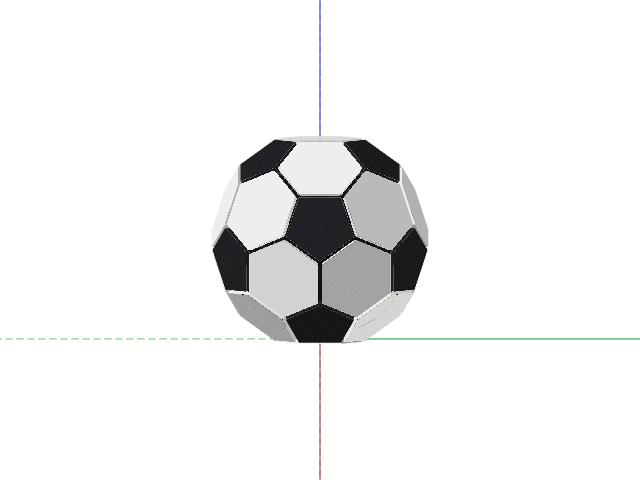

# Heckers Sketch

A simple 3D sketching program for Windows and Linux PCs, modeled on SketchUp.
Free Pascal / Lazarus, free to use, MIT licensed.

## Get it

**[Download the latest release](../../releases/latest)** - one file, no
installer, no account.  Pick the one for your computer and run it:

| File | For |
| --- | --- |
| `heckers-sketch.exe` | Windows |
| `heckers-sketch-linux` | Linux (`chmod +x` it first) |

> **This is an early beta.**  It works, I use it at work, and it is
> changing every few days.  Expect rough edges, and expect to be asked to
> update often.

**[Read the manual](https://tonystone31.github.io/heckers-sketch/)** - every
tool, command and key.  The same pages open inside the program (`/manual`),
from a copy it keeps beside itself.

<p align="center">
  
  
</p>

<p align="center"><i>Two of the drawings that come with it.  Both are built by
a program in <a href="examples/">examples/</a> rather than modeled by
hand.</i></p>

> **It is a desktop program.**  It needs a Windows or Linux computer with a
> mouse and a keyboard.  There is no phone or tablet version, and it does not
> run in a web browser.  There's no Mac version yet either -
> [help wanted](#mac-builders-wanted).

---

## What it is, and what it isn't

It is a **sketching tool that gets the measurements right** - quick models
and layouts where an honest dimension matters more than a pretty picture.
I'm an HVAC technician and I use it at work for exactly that.

It is **not a CAD program** and isn't trying to compete with one, or with
SketchUp.  The plan is to keep it accurate and useful without letting it get
complicated.  SketchUp is the model for how the tools behave, on purpose:
close a loop and it becomes a face, push a face into a solid, snap to
endpoints and midpoints, type a length instead of dragging for it.

## What's in it

The manual covers all of this properly.  The short version:

* **Drawing** - lines, rectangles, circles, arcs, offset, move, rotate,
  erase, text notes with leaders.
  [Tools](https://tonystone31.github.io/heckers-sketch/)
* **Typed lengths** - `12'6"`, `6-8-15`, `3.5m`, `8x10`, sums like
  `8' + 6"`, and exact points like `[4,0,8]`.
  [Typing measurements](https://tonystone31.github.io/heckers-sketch/typing.html)
* **Faces and solids** - faces come from the edges that close them;
  push/pull, drill and revolve turn them into solids.
  [Faces](https://tonystone31.github.io/heckers-sketch/faces.html) ·
  [Solids](https://tonystone31.github.io/heckers-sketch/solids.html)
* **Snapping and inference** - endpoints, midpoints, centers, crossings,
  axis locks.  [Snapping](https://tonystone31.github.io/heckers-sketch/snapping.html)
* **Measuring** - tape measure, guides, protractor, and dimensions you can
  type over to resize what they measure, including the radius and diameter
  of circles and arcs.
  [Tape measure](https://tonystone31.github.io/heckers-sketch/tools/measure.html) ·
  [Dimensions](https://tonystone31.github.io/heckers-sketch/tools/dim.html)
* **Views** - free 3D with a view cube, plan with a height slice, and true
  isometric paper.  [Plan](https://tonystone31.github.io/heckers-sketch/plan.html) ·
  [View cube](https://tonystone31.github.io/heckers-sketch/cube.html) ·
  [Orbit](https://tonystone31.github.io/heckers-sketch/tools/orbit.html)
* **Printing to scale**, and exporting PNG, JPEG, animated WebP, SVG, PDF,
  DXF, STL and OpenSCAD.
  [Printing](https://tonystone31.github.io/heckers-sketch/printing.html) ·
  [Export](https://tonystone31.github.io/heckers-sketch/export.html)
* **Groups** - make a piece of the drawing a thing of its own, so nothing
  else sticks to it; open it to work inside, lock it, name it, nest them,
  and find them all in the groups panel.
  [Groups](https://tonystone31.github.io/heckers-sketch/groups.html)
* **Files and sheets** - several drawings in tabs, saved together in one
  `.hsk` file.  Your work is also saved to a draft every few seconds.
  [Sheets](https://tonystone31.github.io/heckers-sketch/sheets.html)
* **The drawing as text** - a drawing is saved as **Heck**, a plain-text
  language a person can read (`box = 0 east, 0 north, 0 up; 4' east,
  3' north, 2' up`).  `/source` shows it live beside the drawing and
  editable both ways.  There is no scripting API; instead a group can be
  made by a **jig** - *Just Include Geometry*, any program that prints
  Heck, in whatever language is on the machine.  Text also means a drawing
  works under **git**.
  [Heck](https://tonystone31.github.io/heckers-sketch/heck.html)
* **A command bar** - type `/` and a searchable list of every command comes
  up, so there is nothing to memorize.
  [Commands](https://tonystone31.github.io/heckers-sketch/commands.html) ·
  [Keys](https://tonystone31.github.io/heckers-sketch/keys.html)

### The shop tools

The **SHOP** menu holds tools built for my own work - duct fittings, pipe
spools, sheet metal flat patterns, stairs and a radiant floor layout.
They're specific to the trades, so they're kept out of the way; the rest of
the program doesn't need them.

## Installing

Download the file for your computer from
**[Releases](../../releases/latest)** and run it.  The `*-checked` builds
there are the same program with extra error checking - slower, but they
give better crash reports.

It's portable: settings and the draft live next to the program, so it can
run from a USB stick.  It keeps its own copy of the manual in a `help`
folder beside itself, fetched from the matching release.
`--help` lists the command-line switches.

## What it does on the network, plainly

No account, no sign-in, no tracking, and nothing that identifies you or
your machine.  Everything it does online is listed here, and `--offline`
switches all of it off:

* **Looks for a newer version.**  Every few hours it asks GitHub what the
  latest release is - one request, nothing about you or your drawing in
  it - and `/update` installs it.  `/update never` turns the check off.
* **Sends a bug report when you ask it to.**  Help → Report a problem sends
  a screenshot, your note and what the program was doing; your drawing goes
  only if you tick the box.  If it crashes, it offers to send the crash
  report.  A report is encrypted before it leaves, and travels through a
  public file drop that throws files away after a few days - there is no
  server behind it.
  [Reporting a problem](https://tonystone31.github.io/heckers-sketch/reporting.html)
* **Asks, once, to send a postcard.**  On its second start it asks whether
  it may send one note saying what sort of computer it is on - the
  operating system, processor, memory, graphics, screen - and, if you care
  to say, what you want to use it for.  The whole text is on the screen
  before you answer, *No* is as big a button as *Yes*, and whichever you
  press it never asks again (`/postcard` brings it back).  There is no
  serial number or identifier in it; it goes the same encrypted way a bug
  report goes.

---

## Building

Needs Lazarus, plus these packages:

* **BGRABitmap** and **BGRAControls** - install both from Lazarus's Online
  Package Manager.
* **[LazInk](https://github.com/TonyStone31/LazInk)** - clone it next to this
  folder (`../LazInk`), and the project finds it there.
* **[CryptoLib4Pascal](https://github.com/Xor-el/CryptoLib4Pascal)**,
  **[HashLib4Pascal](https://github.com/Xor-el/HashLib4Pascal)** and
  **[SimpleBaseLib4Pascal](https://github.com/Xor-el/SimpleBaseLib4Pascal)** -
  clone all three next to this folder the same way.  A bug report is
  encrypted before it leaves the machine; this is what does it.  Like
  LazInk, they compile straight into the one executable.
* `Printer4Lazarus` ships with Lazarus.

```sh
lazbuild etchasketch.lpi
./bin/etchasketch
```

The program is built into `bin/`, and run from there it keeps its settings,
drafts, examples and exports in `bin/` too, out of the way of the source.
Developed on Linux; the Windows build is cross-compiled.

### Mac builders wanted

A macOS build has never been tried.  I don't have a Mac, so if you do and
you'd like to have a go, I'd love the help.  It's Lazarus/LCL plus
BGRABitmap, BGRAControls and LazInk, which are all meant to work on macOS,
and nearly all the drawing is done in the program's own pixel buffers
rather than through the platform, so there's a fair chance it builds
without much trouble.  Open an issue or a pull request with how it went -
even a list of what broke is useful.

## Source layout

The project file is at the top; the units are under `src/`, one folder for
each part of the program, and every unit starts `hs`.

| Folder | What is in it |
| --- | --- |
| `src/app/` | the window and its plumbing: `hsMainForm` (the window and the tools), `hsCommandText` (the command bar's colors), `hsPaths`, the splash, updates (`hsUpdater`), bug reports (`hsBugReport`, `hsSendReport`), the manual's viewer (`hsHelpView`) |
| `src/model/` | the geometry: `hsDrawing` (the 3D document - geometry, snapping, hit testing, rendering), `hsFaceFinder` (edges into faces and holes), `hsImpliedFaces`, `hsTriangulate`, `hsTunnels` (the drill), `hsUnfold` (flat patterns), `hsGroupData` |
| `src/draw/` | pixels: `hsSurface` (the software rasterizer everything is drawn with), `hsSkin`, `hsViewCube`, `hsFilm` and `hsRecorder` (pictures and WebP films) |
| `src/files/` | Heck and the other formats: `hsHeckReader`, `hsHeckWriter`, `hsHeckFile`, the source window (`hsSourceWindow`), jigs (`hsJigRun`), `hsExport`, `hsDxf`, `hsPdf`, `hsSvg` |
| `src/shop/` | trade tools: `hsFittings` and `hsTransitionWizard`, `hsPipe` and `hsSpoolWizard`, `hsStairs`, `hsStairWizard` and `hsStringerSheet`, `hsTapeWizard` |
| `src/radiant/` | the radiant floor layout |
| `src/examples/` | the example drawings, generated by `examples/make-*.pas` |
| `src/vendor/` | the WebP encoder and the bug report's encryption |

## License

**MIT** - see [LICENSE](LICENSE).

Copyright (c) 2021-2026 Tony Stone.
